# Unbrowser Architecture

This document provides visual architecture diagrams for understanding the Unbrowser system.

## Table of Contents

1. [High-Level Overview](#high-level-overview)
2. [Deployment Modes](#deployment-modes)
3. [Tiered Rendering Pipeline](#tiered-rendering-pipeline)
4. [Learning System](#learning-system)
5. [Component Relationships](#component-relationships)
6. [Request Flow](#request-flow)
7. [Data Flow](#data-flow)

---

## High-Level Overview

Unbrowser is an intelligent web browsing API that progressively learns to bypass browser rendering.

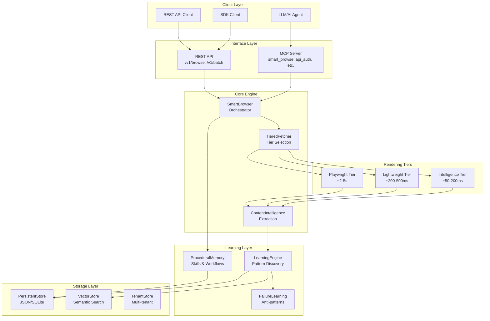

---

## Deployment Modes

Unbrowser supports two deployment architectures:

### Local MCP Server (Production)

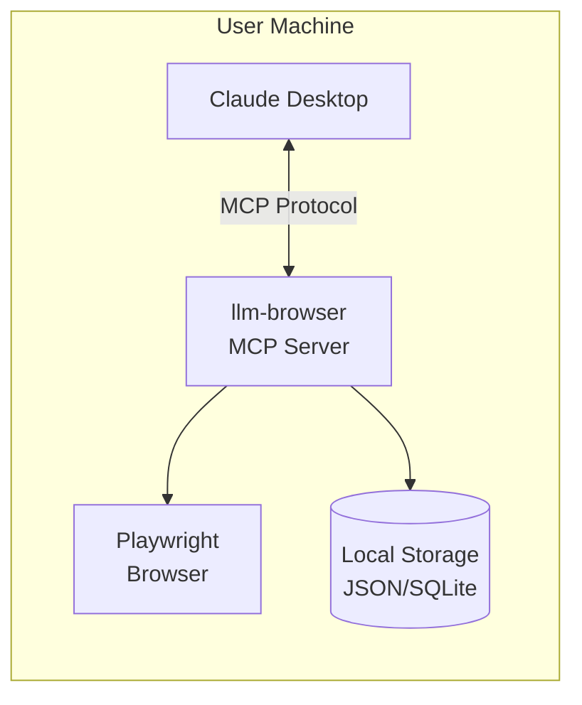

### Cloud API (Alpha)

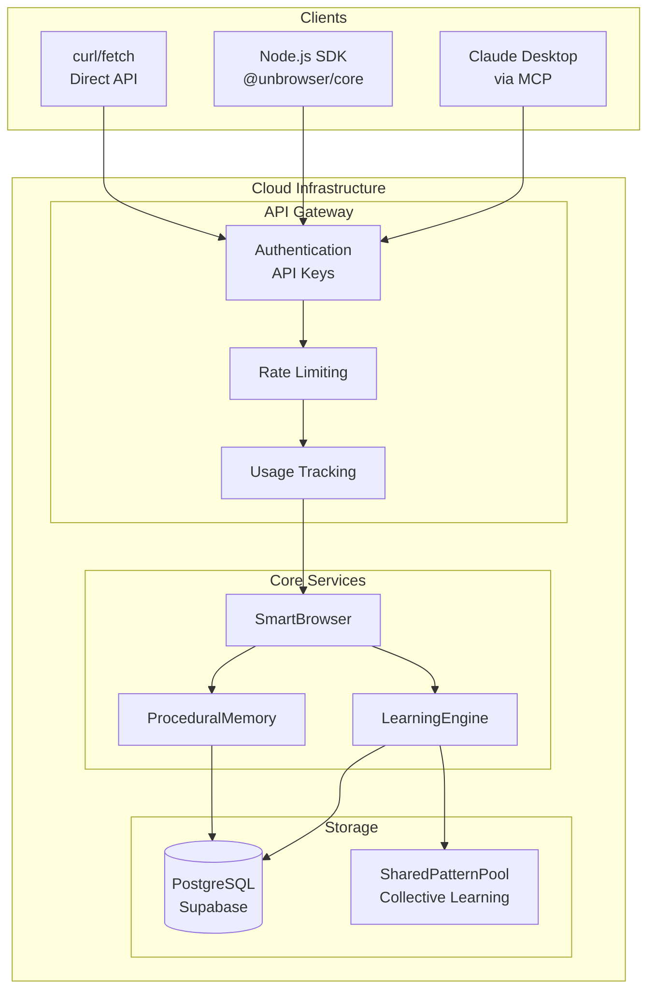

---

## Tiered Rendering Pipeline

The system uses a cascade of rendering tiers, trying the fastest first:

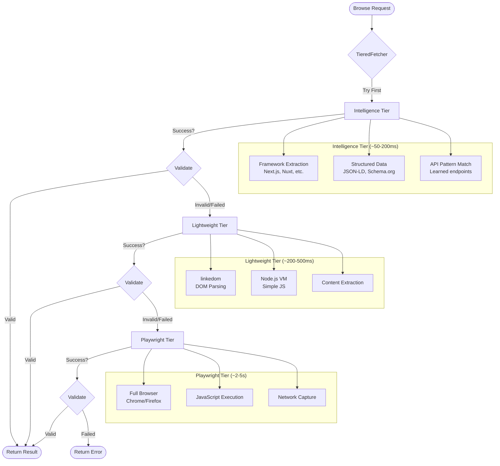

### Tier Selection Logic

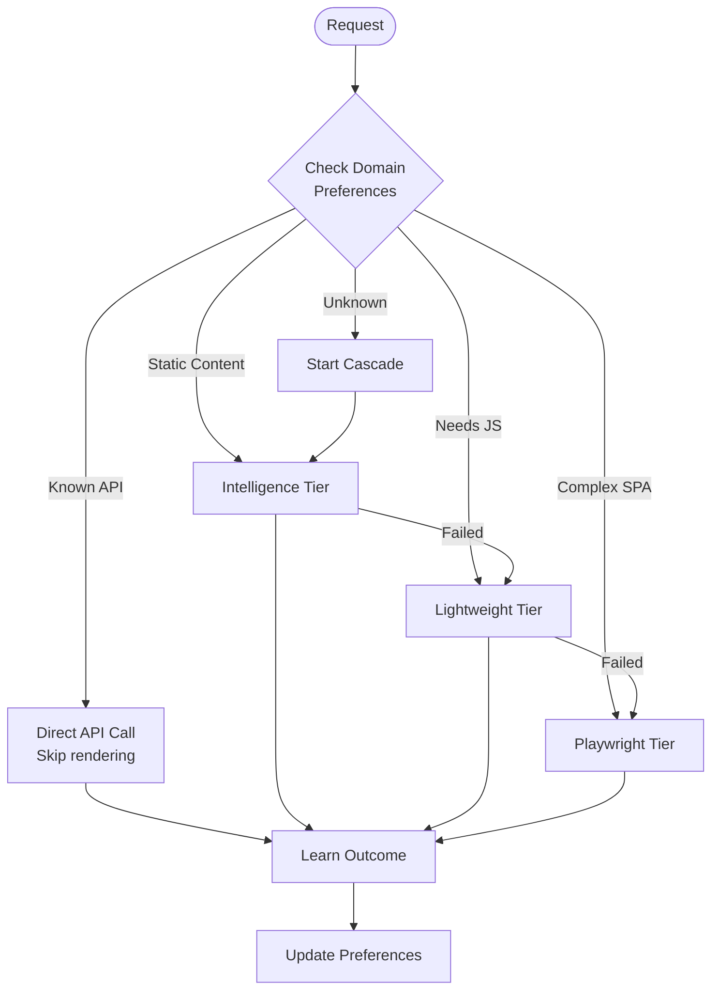

---

## Learning System

### Pattern Learning Flow

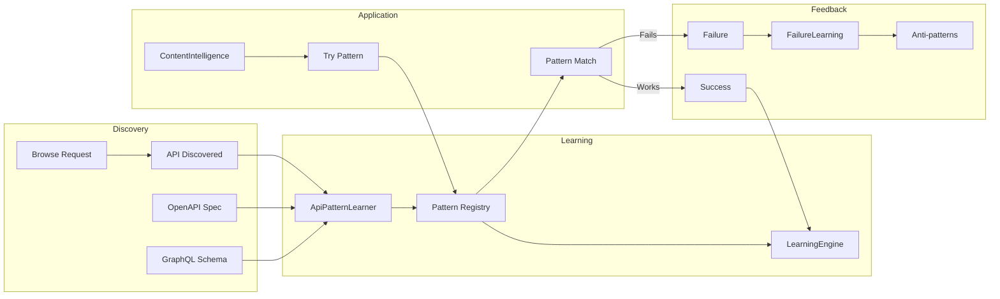

### Skill Lifecycle

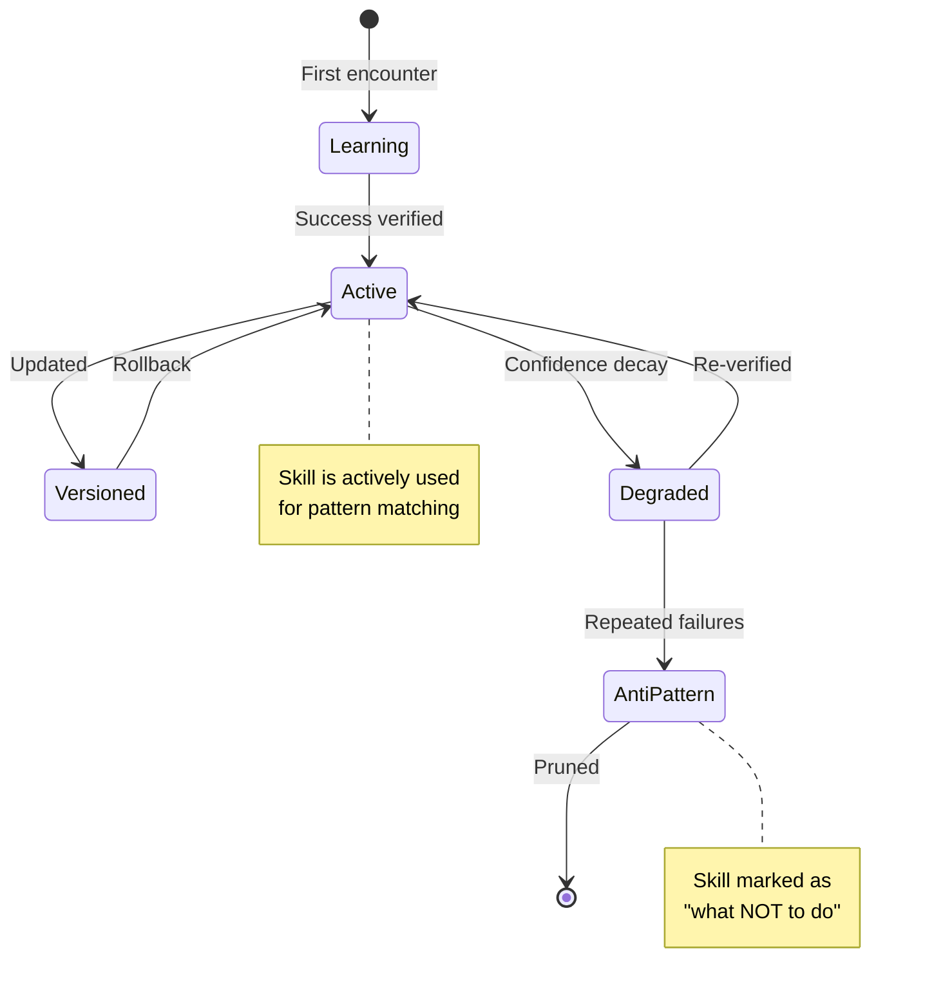

---

## Component Relationships

### Core Components

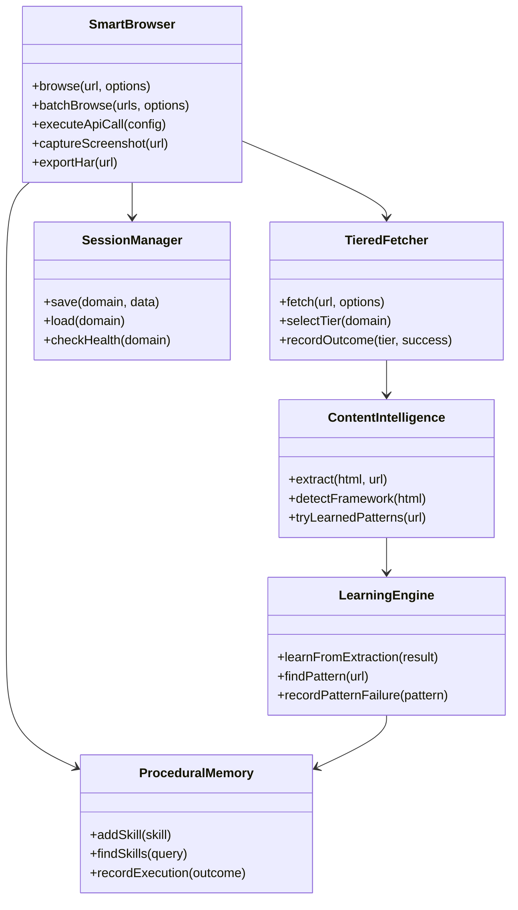

### Storage Architecture

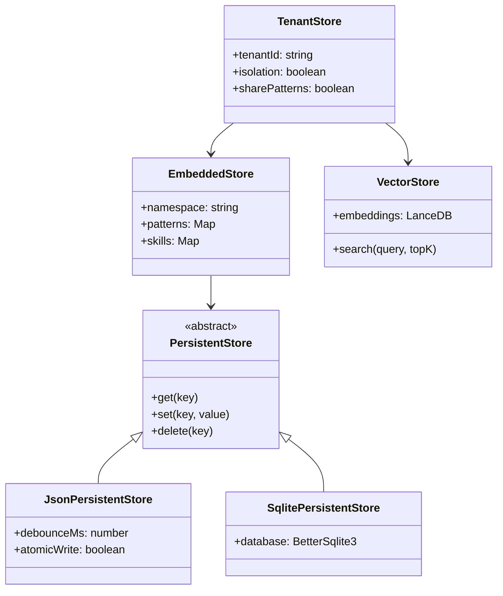

---

## Request Flow

### smart_browse Request

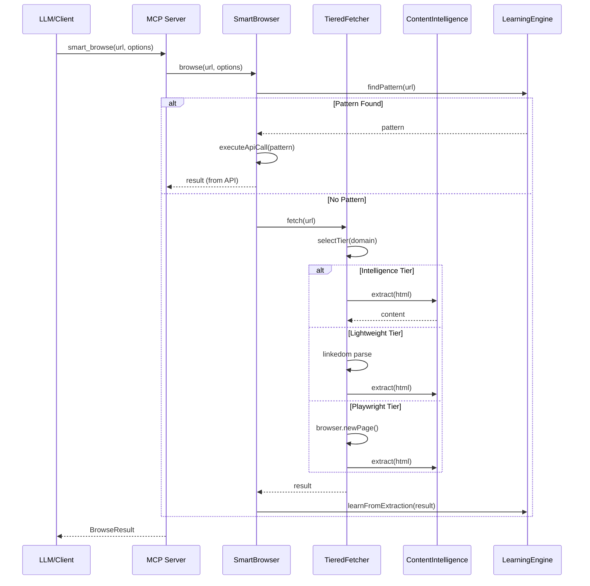

### Authentication Flow

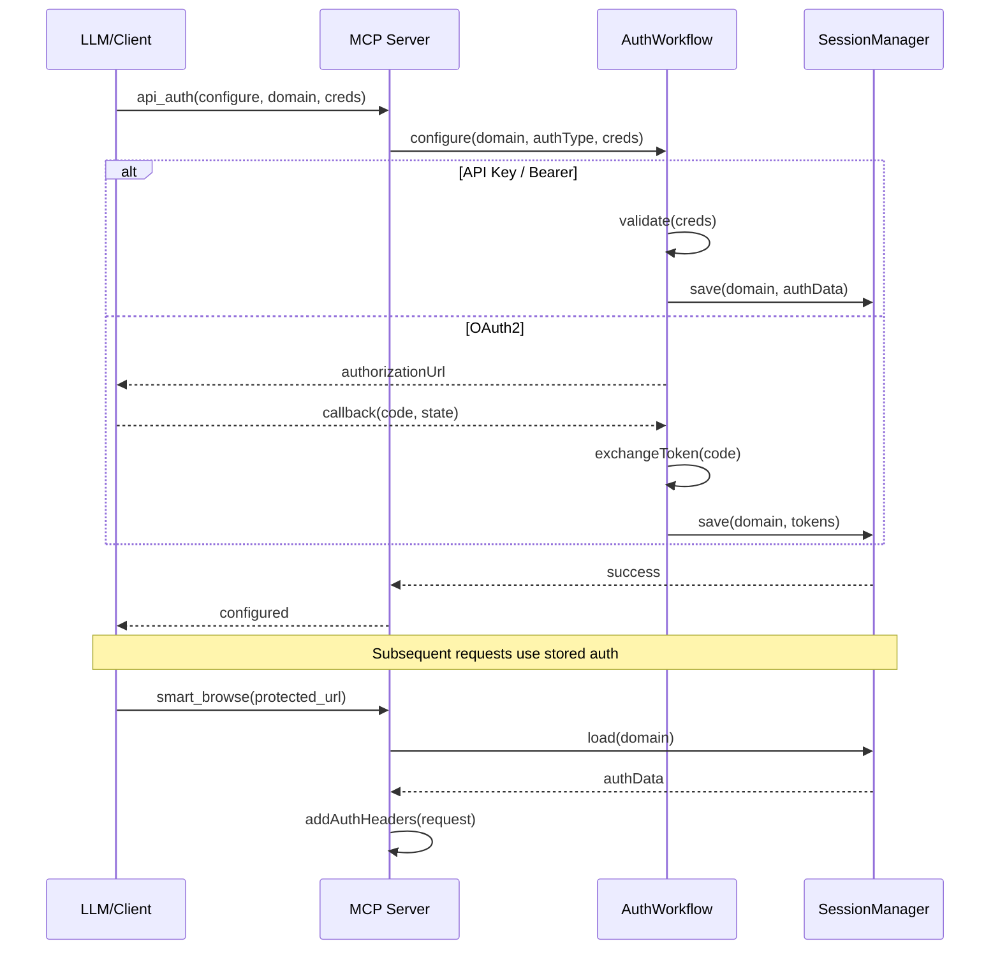

---

## Data Flow

### Learning Data Flow

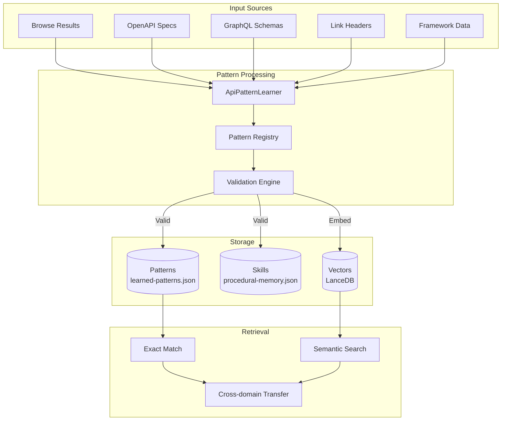

### Multi-tenant Data Isolation

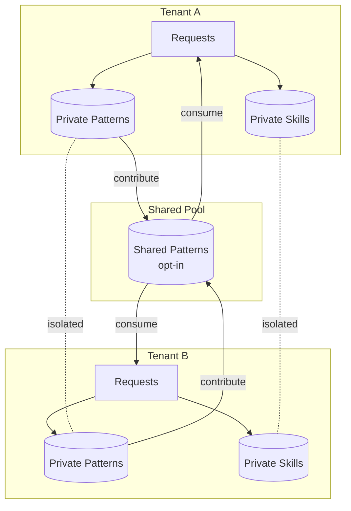

---

## File Structure Reference

```
src/
+-- core/                     # Core components
|   +-- smart-browser.ts      # Main orchestrator (116K)
|   +-- tiered-fetcher.ts     # Tier cascade logic
|   +-- content-intelligence.ts # Content extraction (71K)
|   +-- learning-engine.ts    # Pattern learning (82K)
|   +-- procedural-memory.ts  # Skills & workflows (118K)
|   +-- session-manager.ts    # Session handling
|   +-- failure-learning.ts   # Anti-pattern tracking
|   +-- api-pattern-learner.ts # API discovery
|   +-- stealth-browser.ts    # Bot evasion
|   +-- framework-extractors/ # Next.js, Angular, Vue, etc.
|   +-- site-handlers/        # Reddit, GitHub, npm, etc.
|
+-- utils/                    # Utilities
|   +-- persistent-store.ts   # JSON persistence
|   +-- embedded-store.ts     # SQLite persistence
|   +-- vector-store.ts       # LanceDB vectors
|   +-- tenant-store.ts       # Multi-tenant isolation
|   +-- content-extractor.ts  # HTML to markdown
|   +-- url-safety.ts         # SSRF protection
|
+-- mcp/                      # MCP interface
|   +-- tool-schemas.ts       # Tool definitions
|   +-- index.ts              # Schema exports
|
+-- tools/                    # Tool handlers
|   +-- browse-tool.ts        # smart_browse handler
|   +-- api-call-tool.ts      # execute_api_call
|   +-- auth-helpers.ts       # api_auth handler
|
+-- types/                    # TypeScript types
    +-- index.ts              # Main type exports
    +-- field-confidence.ts   # Confidence scores
    +-- provenance.ts         # Learning metadata
    +-- decision-trace.ts     # Tier decisions
```

---

## See Also

- [MCP Tools API Reference](MCP_TOOLS_API.md) - Complete tool documentation
- [LLM Onboarding Spec](LLM_ONBOARDING_SPEC.md) - Client integration guide
- [PROJECT_STATUS.md](PROJECT_STATUS.md) - Current implementation status
- [BACKLOG.md](BACKLOG.md) - Task backlog
